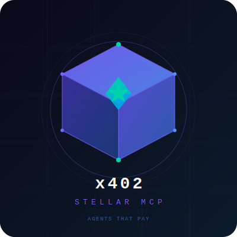
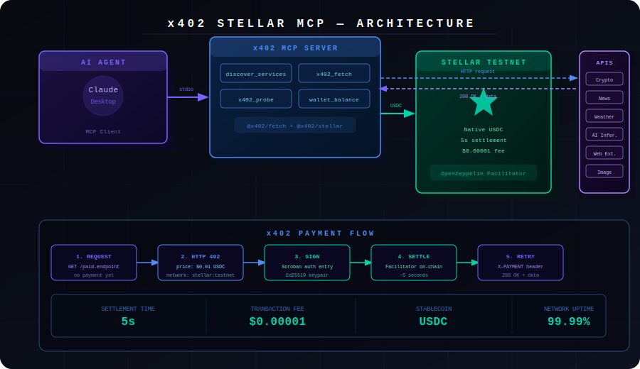
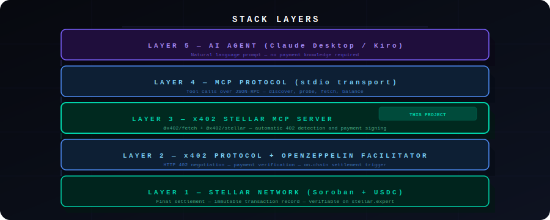
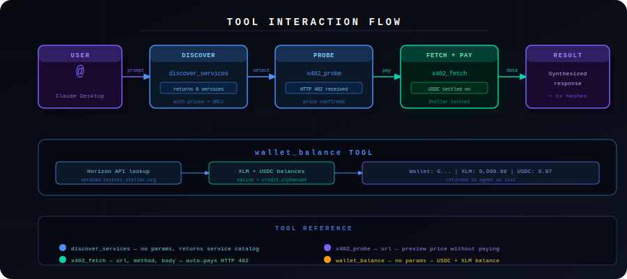
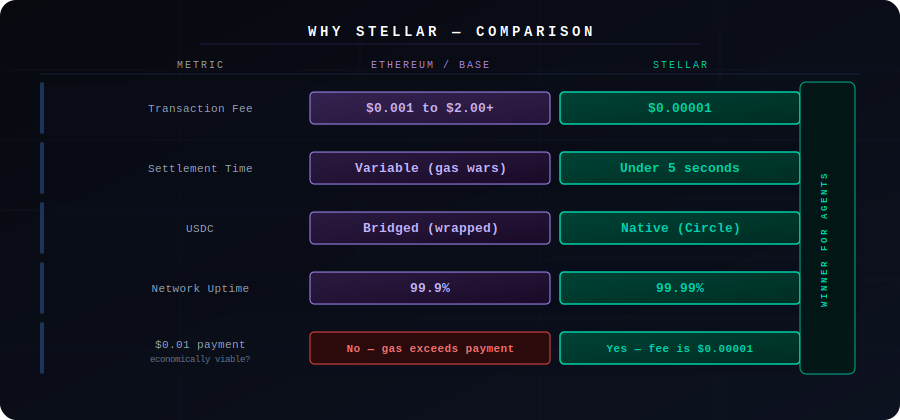

<div align="center">
  
  <h1>x402 Stellar MCP</h1>
  <p><strong>Every AI agent can reason, plan, and act. Until it needs to pay for something.</strong><br/>This is the missing piece.</p>
  <p>
    
    
    
    
  </p>
</div>

---

## The Problem

AI agents are hitting a wall. They can search, reason, and plan, but the moment they need to call a paid API, they stop. Someone has to pre-register an account, enter a credit card, manage API keys, and set up billing. That is not autonomous. That is a human doing the work.

The result: agents are limited to free-tier APIs, or developers pay for subscriptions they barely use. A research agent that needs 50 different data sources cannot subscribe to all 50.

## The Solution

x402 on Stellar fixes this at the protocol level. When an agent hits a paywall, it receives an HTTP 402 response with payment instructions. It pays in USDC on Stellar (under $0.00001 in fees, under 5 second settlement), and gets the data. No accounts. No API keys. No human approval.

This MCP server brings that capability to Claude Desktop, Kiro, and any MCP-compatible agent.

---

## Architecture

<div align="center">
  
</div>

---

## Stack Layers

<div align="center">
  
</div>

---

## How It Works

```
User: "Give me a crypto market briefing"

Agent calls discover_services
  finds: Crypto Data ($0.01), News ($0.01), AI Inference ($0.05)

Agent calls x402_fetch("https://xlm402.com/api/crypto")
  server returns HTTP 402
  MCP server signs Soroban auth entry with Stellar keypair
  OpenZeppelin facilitator settles 0.01 USDC on Stellar testnet
  server returns 200 OK with data

Agent synthesizes and responds
  Total cost: $0.02 USDC
  Real Stellar transactions, verifiable on stellar.expert
```

---

## Tools

| Tool | Description |
|---|---|
| discover services | List all available x402 services with prices and endpoints |
| x402 fetch | Fetch any URL, automatically pay in USDC if HTTP 402 received |
| x402 probe | Preview payment requirements for a URL without paying |
| wallet balance | Check USDC and XLM balance of the configured agent wallet |

---

## Tool Interaction Flow

<div align="center">
  
</div>

---

## Why Stellar

<div align="center">
  
</div>

A $0.01 micropayment on Ethereum costs more in gas than the payment itself. On Stellar, the economics work at any scale. This is not a generic chain swap. Stellar is the only chain where sub-cent agent payments are economically viable today.

---

## Setup

### Step 1: Get a free Stellar testnet wallet

No real money needed. Everything runs on testnet.

```bash
# Generate a keypair and fund with free XLM
# Visit: https://lab.stellar.org/account/fund

# Get free testnet USDC
# Visit: https://faucet.circle.com  (select Stellar Testnet)
```

### Step 2: Install and build

```bash
git clone https://github.com/Tasfia-17/stellar-mcp
cd stellar-mcp
npm install
npm run build
```

### Step 3: Configure your wallet

```bash
echo "STELLAR_PRIVATE_KEY=S..." > .env
```

Your secret key starts with S and stays in the .env file. It is never committed to git.

### Step 4: Add to Claude Desktop

Edit the Claude Desktop config file:

macOS: `~/Library/Application Support/Claude/claude_desktop_config.json`

Windows: `%APPDATA%\Claude\claude_desktop_config.json`

```json
{
  "mcpServers": {
    "x402-stellar": {
      "command": "node",
      "args": ["/absolute/path/to/stellar-mcp/dist/index.js"],
      "env": {
        "STELLAR_PRIVATE_KEY": "S..."
      }
    }
  }
}
```

Restart Claude Desktop. The tools will appear automatically.

### Step 5: Add to Kiro

```json
{
  "mcpServers": {
    "x402-stellar": {
      "command": "node",
      "args": ["/absolute/path/to/stellar-mcp/dist/index.js"],
      "env": {
        "STELLAR_PRIVATE_KEY": "S..."
      }
    }
  }
}
```

---

## Demo Script

This is the exact flow to use in a demo or video walkthrough.

**Step 1: Check the wallet**
```
Check my wallet balance
```
Expected: wallet address, USDC balance, XLM balance.

**Step 2: Discover available services**
```
What paid services can you access on Stellar?
```
Expected: list of 6 services with prices and endpoint URLs.

**Step 3: The autonomous payment**
```
Give me a crypto market briefing and the latest news headlines.
Use the cheapest services available and tell me what you paid.
```
Expected: agent calls discover services, selects crypto data and news, pays for each via x402 on Stellar, returns synthesized briefing, shows total cost.

All transactions are verifiable at https://stellar.expert/explorer/testnet

---

## Project Structure

```
stellar-mcp/
  src/
    index.ts        MCP server with 4 tools and x402 payment client
  assets/
    logo.svg        3D project logo
    architecture.svg  3D architecture diagram
  dist/             compiled output (generated by npm run build)
  package.json
  tsconfig.json
  .env.example
  README.md
```

Single source file. No unnecessary abstraction. The entire x402 payment flow is handled by the official packages from the x402 Foundation.

---

## Dependencies

| Package | Purpose |
|---|---|
| @modelcontextprotocol/sdk | MCP server protocol implementation |
| @x402/fetch | Wraps fetch to auto-handle HTTP 402 responses |
| @x402/stellar | Stellar-specific signer and payment scheme |
| @x402/core | Core x402 protocol types and client |
| @stellar/stellar-sdk | Stellar network interaction |

---

## Why This Matters Now

x402 crossed 154 million transactions and $600 million annualized volume in April 2026. Stripe launched the Machine Payments Protocol in March 2026. Google, Visa, and Cloudflare joined the x402 Foundation. The Stellar Development Foundation explicitly named MCP integration as their next roadmap item. This project ships that roadmap item.

The window to establish the default payment layer for the agentic economy is open right now. Stellar is the right chain: the fees work, the stablecoins are native, the uptime is proven, and the MoneyGram off-ramp connects agent payments to 170 countries.

---

## Who Uses This

**AI developers** building agents that need data without managing API keys per service.

**API providers** who want to monetize per call instead of forcing subscriptions.

**Enterprises** deploying agents that need controlled, auditable spending with programmable limits.

---

## Roadmap

- Bazaar integration: agents discover services dynamically from the x402 discovery network
- Spending policy layer: Soroban smart contract enforcing per-transaction and daily limits
- Python SDK: same capability for LangChain, CrewAI, and AutoGen agents
- OpenClaw skill: one-click install for OpenClaw users

---

## Built With

- [x402 Protocol](https://www.x402.org) by Coinbase and Cloudflare
- [Stellar Network](https://stellar.org) by Stellar Development Foundation
- [Model Context Protocol](https://modelcontextprotocol.io) by Anthropic
- [OpenZeppelin Facilitator](https://docs.openzeppelin.com/relayer) for Stellar x402

---

## License

MIT
